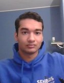

# GoGreen OOPP Project Group 10

This is the repository of the GoGreen Project for Group 10

Intellij:  
[https://www.jetbrains.com/help/idea/2016.2/importing-project-from-maven-model.html](https://www.jetbrains.com/help/idea/2016.2/importing-project-from-maven-model.html)

## Getting your weekly reports

**Jacoco**:  
Run `maven install` ([Intellij](https://www.jetbrains.com/help/idea/2016.3/getting-started-with-maven.html#execute_maven_goal)/[Eclipse](http://imgur.com/a/6q7pV))

**Checkstyle**:  
Run `maven site`

## The team members and their development plans

# Rauf's Personal Development Plan

## My plan: become better at retaining oversight in complex projects by effectively communicating (receiving and sending) ideas and tasks with other team members and making sure everyone is on the same page. 

This is important to me because I believe synergy is the most important factor in getting complex work done, and I believe communication is key to this.

This goal is achieved when we can effectively break down and tackle problem as a team; mid-project or nearing the end.

I try to achieve this by talking openly, asking people for their ideas and having everyone say something they would like to add.

I hope to be able to implement communication systems, or agreements on particular communication, so that people will be constantly updated about my work and I know their work.

I think Git will be able to help us in this.

---
Name: Himanshu Pathak
  
Student Number: 4823567
  
NetID: hpathak

  
Personal Development:

**Strong Point**
- I like to challenge myself in finding the most efficient possible paths that can be taken in order to create a function.
- I am fairly profficient in programming in java and have understanding of algorithms.

**Weak Point**

- Efficiently distributing work load between team members and working collaboratively in a group.
- Not much knowledge about different softwares that are required to make a functioning application with backend and frontend software and how they communicate together.

**G (Grow)**
1. Learn to efficiently work in a team and learn to delegate tasks based on strengths and weaknesses.
1. Implement the different software systems that are required for making a robust piece of software that contains server/client communication and methods of storing and retrieving data.
---

# Tamer's Personal Development Plan

Name:Tamer Sahin

Studentnumber: 4952936

NetID: tsahin

Personal Plan:

Because this is my first year with Java, and other programming stuff, I can not say that I'm a Java master. But I can think Object Oriented, so I think I will be fine.

After the bachelor I know that as a programmer, you need to work with other people. So my main goal is to train myself to work efficiently with people who I don’t know. 
Each of these people with other abilities will learn me a lot.

The key to pass the course is: communicating! 

If we work as a group, I'm sure that as a group we will all become better programmers. If I have to speak for myself. I am sure about that after this project I will be better at 
coding and communicating.

---
# Michael's Personal Development Plan

Name: Michael Chan

Student Number: 4953770

NetID: jmchan

Personal Development Plan:

Strong points:
- Good at communicating with team members

Weak points:
- Not very creative
- New to coding (I get stuck alot when I do coding)

Goal:
Get more experience with coding in general. I am currently really new at coding and I have never coded together in a team before. This project is a great opportunity to get more experienced with coding individually as well as coding in a team. We're also going to organize coding sessions so we can help eachother out whenever we are stuck.

---
# IJsbrand's Personal Development Plan

name: IJsbrand Slagmolen  
netid: islagmolen@tudelft.nl  
  

Strong point: always looking to develop new skills. An example of this is that I stopped working and started studying again as I saw my current skills were unsufficient for the tasks I'm interested in. This shows in a team by me being driven to learn.  

Weak point: planning. I'm not the most organised person. An example of this is how I struggle to combine life with studying. In a team this might show by me not being up to date on all the details.  

What I want to gain most from doing this project is experience in developing an application. My current reality is that I have never done so before. I know how to code but I have never coded in a team.  
I'm hoping to improve my general teamworking skills, specifically with regard to splitting up coding tasks. The thing I hope we'll use a lot for this is our SCRUM-board, as this is also the way to do things in a professional setting.  

In addition, I hope to improve my planning skills. The main way I shall do this is by following a booklet on study planning I got. 

---

## Oliver's Personal Development Plan
name: Oliver Neut
netid: oneut@tudelft.nl

Personal Development Plan :

I really like creating stuff and this project is no exception, with this project I want to improve skills in various fields like communicating, creativity and engineering.

# Weaknesses : 
- beginner in java and other programming languages
- not much understanding of how an application should be made and what goes into it

# strengths :
- I can pick up things decently fast
- I like working efficiently in group / being productive

I started coding this year so I am very new to programming, so that's why in this project I want to: 
- get to know how working on a big software project in team feels like
- get better at coding in java in general
- have a better understanding on how an application works
- know what goes behind the making of an application
- get good at working efficiently in a team
- 
---

## Nima Khaksar- Development plan:

- Name: Nima Khaksar
- netid: nkhaksar
- Student nr: 4840488

I want to develop my ability to become a leader for future and larger projects by contributing with my skills and pushing my limits to the maximum. 

The communication between the teammates are also an essential part for the leadership within a project and therefore, I also have the ambition to 
improve my communication skills.

Additionally, I want to develop my current programming skills with Java GUI by applying it to various fields and projects. 

Finally, I want to improve my problem solving skills by simplify or finding new or alternative solutions to existing ones.

# Strong Points:
- Curious and always want to find new ways or solutions to existing problems
- Do everything on time and contribute actively with my skills to all projects
- I don`t leave anything half solved.

# Weak Points:
- I have to develop my ability to become a leader

---

